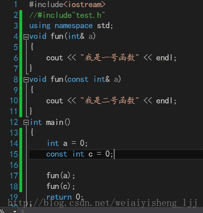
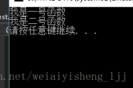

# 浅析 C++ 函数重载的原理

**一.** **函数重载的概念**

在C语言中，一个函数不能与另一个函数重名，而在C++中，一个函数的函数名相同的，只要参数列表与另一个函数的参数列表不完全相同，C++ 这一特点就是所谓函数的重载现象。

同一个名字因为参数列表不同，展现了不同的结果，也叫静多态（他和运算符重载都是编译期就确定了的）

**二.函数重载的原则**

①函数名相同，函数参数列表不同(类型、个数、顺序)

②匹配原则1：严格匹配，找到再调用

③匹配原则2：通过隐式类型转换寻求一个匹配，找到则调用

④返回值类型不构成重载条件（注意‼️）

 

**三.重载的原理**

C++ 实现函数重载的技术手段是函数符号改名，所以我们可以通过分析编译器的函数符号改名机制来验证C++ 函数重载规则。 

**先来了解一下c++** **编译器的命名规则**：实际上函数的编译符号是根据函数名，函数的参数表（包括参数类型和数量）相关的。而且不同的编译器的命名规则不一样。只要能保证相同的函数名和不同的函数参数列表生成的符号名不一样就行。 

因此在实际的函数调用过程中，重载的函数因为参数的不同（类型，顺序，数量），会生成不同的函数名，因此可以实现不同参数的不同函数调用。从而实现了函数的重载。

**四.注意const 关键词**

当参数是普通的非 int* int& 的参数时，const修饰的参数是不构成重载的。

当参数是 `int*、int&、 const int*、 const int&` 时，是构成重载的，在实际的函数调用过程中，底层的函数名是不同的。

实例中，const修饰的函数参数是可以构成函数重载的

 

 